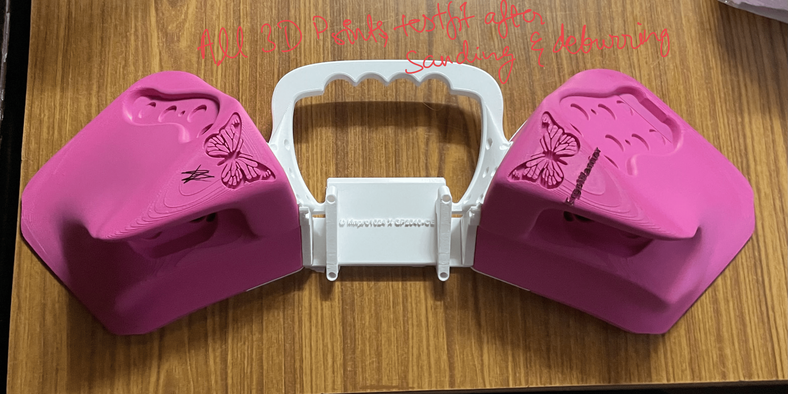
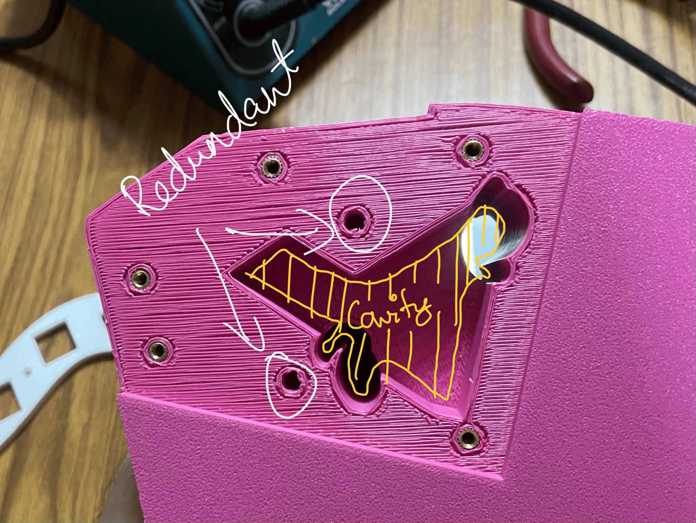
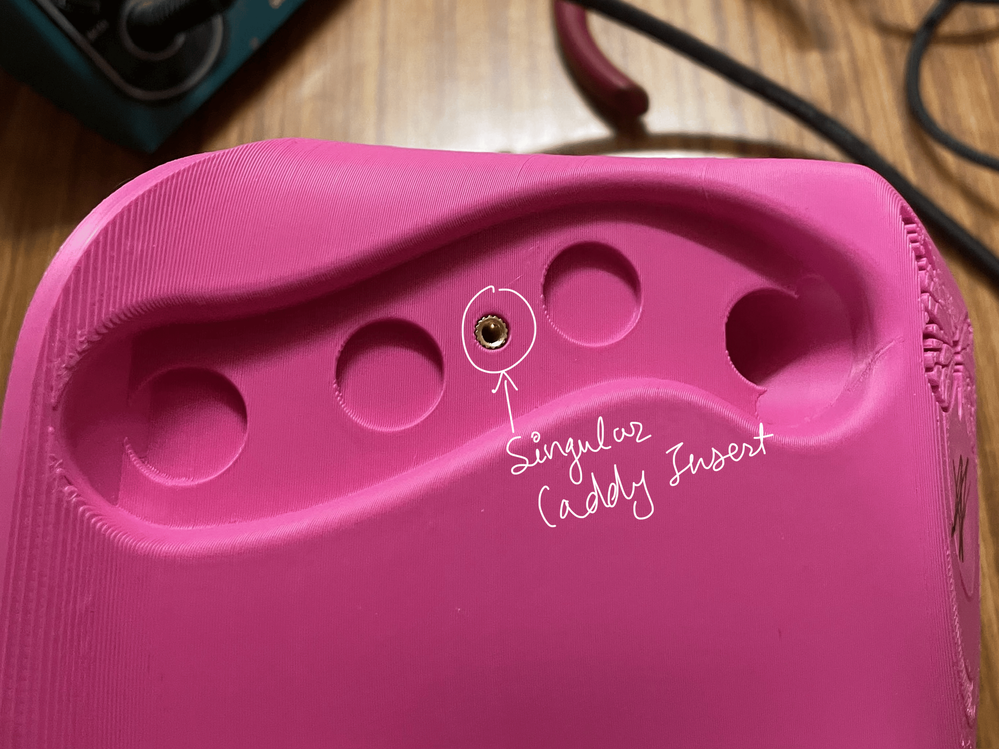
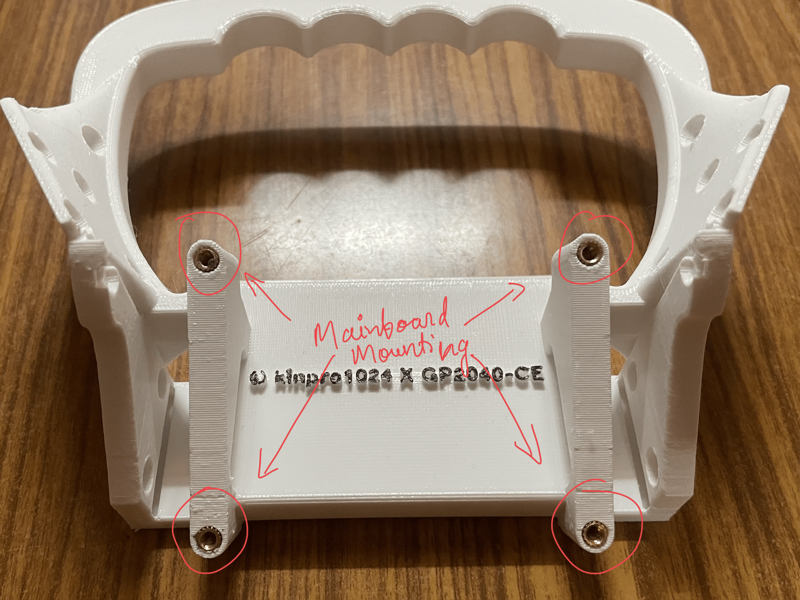
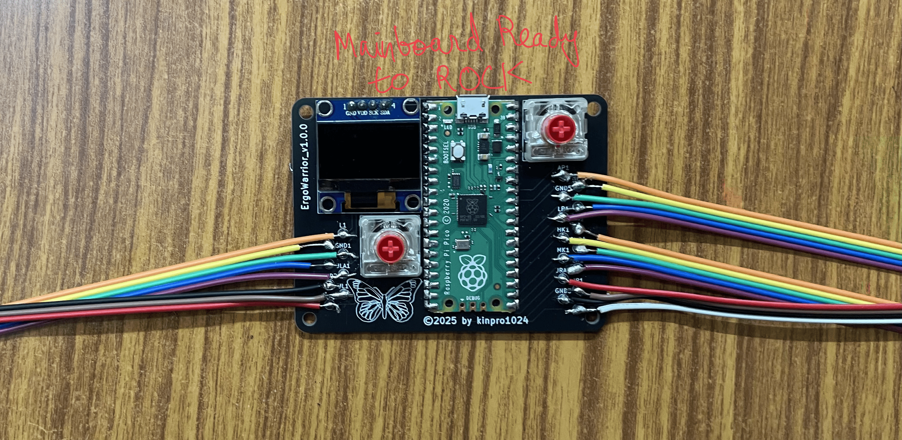
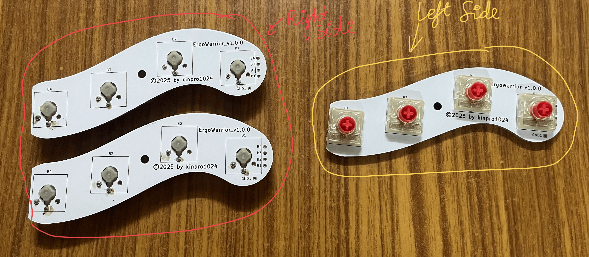
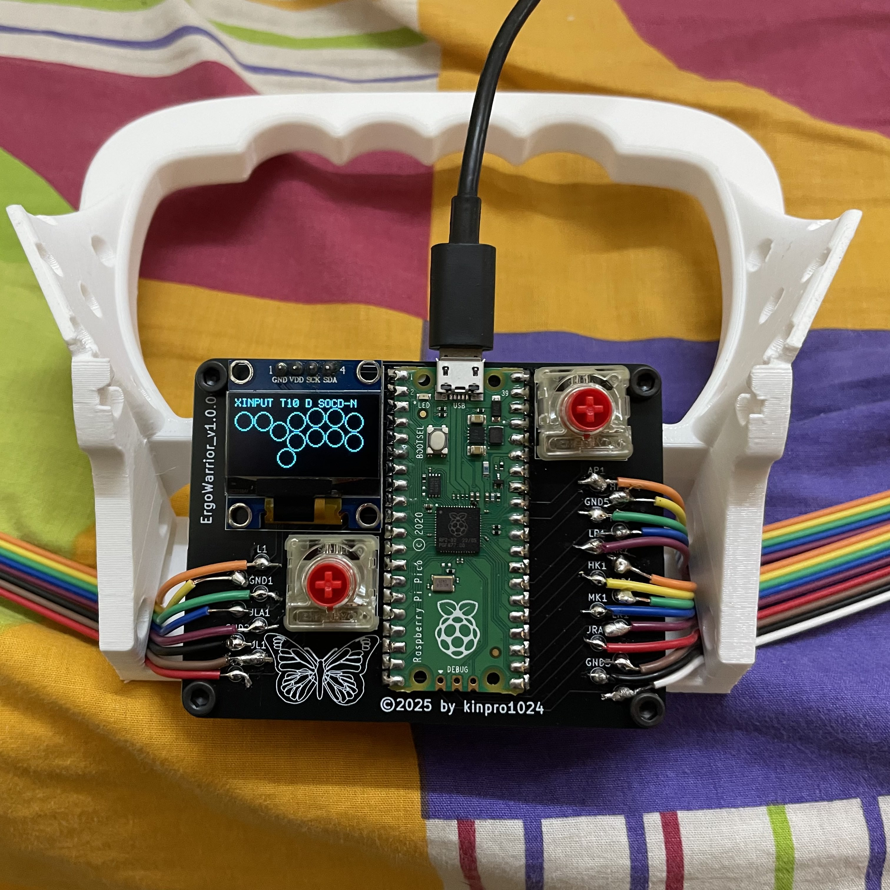
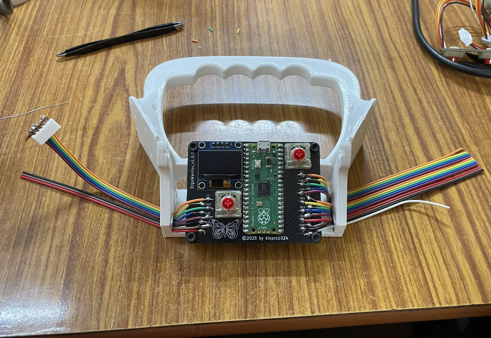
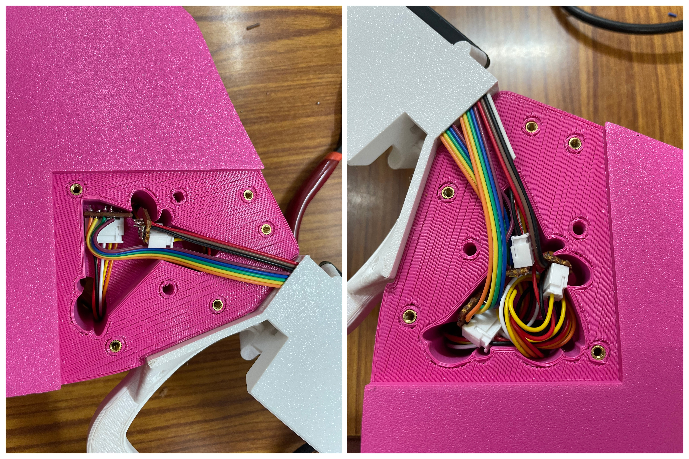

# ErgoWarrior Assembly Instructions & Bill of Materials

The complete assembly instructions and Bill of Materials (BOM) for the ErgoWarrior are provided below.
**Please Read through the whole thing once before you start any assembly so you are acquainted with the ins, outs and ErgoWarrior's many jagged edges.**
*Please follow them closely to ensure optimal performance and a smooth build experience. It is also assumed you practice basic assembly hygeine and follow practices like "measure twice, cut once" and "small checks prevent massive wrecks".*

---

# Bill of Materials (BOM)

**The BOM intentionally includes redundancies.** If one of your connectors arrives faulty or fails during assembly, you will still have enough extras. Mechanical hardware and consumables both include spare units for reliability. However, add padding quantities inversely proportional to your experience and competence.
*PCBs follow MOQ requirements from your manufacturer. I used JLCPCB and do recommend them.*

## A. 3D-Printed Parts
- 18× Ultralight Arcade Button  
- 1× ErgoWarrior – Left Contour  
- 1× ErgoWarrior – Right Contour  
- 1× ErgoWarrior – Bridge
- 1× ErgoWarrior – Left Bottom Plate  
- 1× ErgoWarrior – Right Bottom Plate  

## B. Mechanical Hardware
- 50× [M3 × 10mm Socket Head Screws](https://onlyscrews.in/products/m3-x-10mm-hex-allen-socket-head-high-tensile12-9-black-anodized-screw?_pos=17&_sid=9edb84e19&_ss=r)
- 50× [M3 × 8mm Injection Moulding Brass Heat Inserts](https://onlyscrews.in/products/m3-x-8mm-brass-threaded-inserts)

## C. Electronics
- 1× Raspberry Pi Pico (RP2040, Pico 1)  
- 1× ErgoWarrior V1.0.0 Mainboard PCB (Leaded works fine but preferably RoHS compliant, with Black Solder Mask and White Silkscreen) (Google for more info)
- 3× ErgoWarrior V1.0.0 Finger Caddy PCB (Leaded works fine but preferably RoHS compliant, with White Solder Mask and Black Silkscreen) (Google for more info)
- 2× ErgoWarrior V1.0.0 Thumb Caddy PCB (Leaded works fine but preferably RoHS compliant, with White Solder Mask and Black Silkscreen) (Google for more info)
- 1× 0.96" I²C OLED Display (Generic Will Do)
- 18× Low-Profile Cherry MX Red Switches (Linear recommended)  
- 4× 5-Pin JST Connectors (male, pre-soldered to female, unsoldered)  
- 3× 3-Pin JST Connectors (male, pre-soldered to female, unsoldered)
- 1× Small Perfboard (Standard 100mil/2.54mm pitch)  

## D. Consumables
- 50× [M3 × 8mm Injection Moulding Brass Heat Inserts](https://onlyscrews.in/products/m3-x-8mm-brass-threaded-inserts)
- 1x 1m 40 Wire 24AWG Ribbon
*(No glue, adhesive, or lubricant required.)*

## E. Tools Required
- 1× M2.5 Allen Key (M3 screws, so 1 size down) 
- 1× Soldering Iron  
- 1× Wire Stripper/Cutter (generic is sufficient)
- 1× Pair of Pliers  
- 1× Pair of Tweezers  
- 1× Multimeter

### Optional Tools (I did not use these)
- Helping Hands  
- Flush Cutter / Side Cutter

---

# SECTION 1: 3D PRINTING
This section includes details and postprocessing of all the 3D prints you will need for building the ErgoWarrior v1.0.0. Also Note that I colour the raised lettering with a black permanent marker.

## Step 1: Obtain the STLs (and the Handle 3MF for v1.1.0) and Slice Them
1. Download all the required STL files from the ErgoWarrior repository.  
2. Import the STLs into your preferred slicer (I use OrcaSlicer.).  
3. Use the recommended layer heights and refer to the `.3mf.gcode` files in the repository:
   - **All parts except the Ultralight Arcade Button:**  
     0.20 mm layer height  
   - **Ultralight Arcade Button:**  
     0.08 mm layer height (for resolution and smoother travel)
4. You will need **18× Ultralight Arcade Button** pieces in total.
5. For detailed print settings (perimeters, infill pattern, supports, cooling),  
   refer to the included `.3mf.gcode` files in the repository. Here are some tips:
   - Certain parts (especially the Ultralight Arcade Button) must use **concentric** top/bottom layers.
   - Some parts may include tuned infills or speeds, use them as a reference or follow them exactly.

---

## Step 2: Print the Parts
1. Begin printing according to the preset profiles from the repository.  
2. Ensure nothing is scaled unless explicitly noted.  
3. After printing:
   - Remove supports if needed.  
   - Clean up edges, stringing, or elephant’s foot and deburr.

---

## Step 3: Install the Heat Inserts

1. For every designated hole in the printed parts, install an M3 heat insert. (Including 4 on the bridge for Mainboard Mounting.) 
   All insert pockets are designed to self-align, even with injection-mold–style brass inserts.
2. Using a soldering iron with a flat tip (or a cone tip you don’t mind using on brass):
   - Gently heat the insert.
   - Apply light downward pressure.
   - Stop as soon as the insert sits **flush with the surface** of the part.

### ⚠️ **IMPORTANT WARNING — READ BEFORE CONTINUING**
**It is *highly recommended* that you install the heat inserts in the *bottom plates first* and screw the bottom plates onto the handle *before* installing the handle’s heat inserts.**

Two of the heat-insert pockets in the handle sit *very* close to the bottom-plate edge.  
If the bottom plate is *not* attached during installation:
- The heat can deform the surrounding plastic.  
- This can cause loss of tolerance.  
- **The bottom plate may no longer fit properly.**
By securing the bottom plate first, you keep the bottom geometry under compression and fully protected during the heating process.
After confirming the bottom plate fits perfectly and is screwed into place, proceed to install the remaining heat inserts on the handle.

---

# Section 2: Electronics
Before installing any electronics into the chassis and any assembly, several sub-steps must be completed.  
This ensures correct wire lengths, clean solder joints, and strain-free routing inside the enclosure.

---

## Step 4: Tin All Pads and Make Colour Schema
1. Begin by tinning **all wire pads** on the Mainboard.
2. Prepare your wire color schema in **ribbons/clusters of 5 and 3**, matching the 5-pin and 3-pin JST connectors:
   - This keeps wiring organized.  
   - Prevents tension and unintentional braiding during soldering.
   - Ensures the wires naturally align with their PCB pads.

---

## Step 5: Cluster and Prepare Wire Lengths
1. Measure wire lengths so that they reach comfortably from Mainboard to Contour Cavity **WITH MORE THAN ENOUGH SLACK** to:
   - Fit through the provided routing and be cut later 
   - Avoid bunching  
   - Avoid excess strain  
2. Separate your wires into “slides” (ribbons) of 5.  
3. **Color-code your grounds**:
   - Example used during development:  
     - Green = ground for finger caddies  
     - Black = ground for thumb caddy  
4. **IMPORTANT:** Only the ground wire position must remain consistent.
   All other lines are configurable in software.

### ⚠️ **CRITICAL WARNING ABOUT GROUND ALIGNMENT**
**Always ensure that grounds line up between connectors.**  
For a 5-pin JST connector, the ground wire should be placed in the **center pin**.
For a 4-pin JST connector, the ground wire should be placed in the **center pin**, even though I did not, it makes everything so much simpler.

It is strongly recommended to accomodate ground wires only on the **caddy side**, because:
- The finger-caddy wires lie separate and can handle twist without stress  
- Twisting from the Mainboard side causes:
  - Shear stress on adjacent wires  
  - Higher rigidity → more internal tension
  - Increased thickness → may block fitment inside the chassis  
  - Risk of broken solder joints  

Never twist the wire bundle coming out of the **Mainboard**.

---

## Step 6: Solder the Raspberry Pi Pico and OLED Display
1. Place the Pico onto the Mainboard using tweezers to align it carefully.  
2. Tack it down with a **single, gentle solder joint** to anchor it.  
3. Once aligned perfectly, solder the remaining pads cleanly.
4. Now Install the 0.96" I²C display using standard **2.54 mm (100 mil)** header pins.  
5. Solder the header strip to the display first.  
6. Then solder the entire display assembly onto the Mainboard.

---

## Step 7: Solder the Caddy Keys
1. Bear in mind the Caddies are reversible so nail down the orientation of the pcb before soldering.
2. Now Solder all the Cherry MX Keys on the Caddies.

---

## STEP 8: INSTALLING THE WIRES (EXCEPT THE FEMALE JST CONNECTORS)

Before proceeding, remember:  
### ~~DO NOT SOLDER THE FEMALE JST CONNECTORS YET, DUE TO AN OVERSIGHT ON MY PART YOU CAN'T ASSEMBLE ERGOWARRIOR IF YOU SOLDER FEMALE JST CONNECTORS BEFORE MOUNTING THE PCB ON THE BRIDGE.~~
## THIS FLAW HAS BEEN ADDRESSED AND FIXED IN V1.1.0.
### IT IS NOW ACTUALLY RECOMMENDED TO FULLY ASSEMBLE THE PCB BEFORE ANY INSTALLATION. IT IS UPTO YOU TO NOW MAKE THE DECISION, USE A LITTLE COMMON SENSE AND CRITICAL THINKING TO DECIDE THE BEST PATH FOR YOU.
**The female JST connectors cannot physically fit through those holes.**

Additionally:  
**The JST connectors (specifically the *male* JST housings) are to be installed on the caddy side — not on the mainboard side.**

This step covers soldering the bare wires directly to the mainboard pads and the Caddy Side as Well.

1. Solder the Wire Ribbons to the Mainboard Pads
Ensure all wire ends are **pre-tinned**.  
Solder the wires directly to the mainboard pads in organized **clusters**, matching their routing paths.

*Right Side*
- Solder three clusters onto the right-side pads:
- A **5-wire cluster**
- A second **5-wire cluster**
- A **3-wire cluster**
- *(Note: In the reference photo, the **white wire** is redundant and included only for completion.)*

*Left Side*
- Solder one **5-wire cluster**
- Solder one **3-wire cluster**

These joints must be clean and flat to avoid fitment issues later.

2. Prepare the Wire Ribbons for Routing Through the Chassis

After soldering all wire clusters to the mainboard:
- Gently Pass the wire ribbons in the direction they will route through the Bridge's side channels.  
- Ensure the wires lie flat and untwisted to prevent tension.

3. Solder the Male JST connectors on the Finger Caddy and Thumb Caddy. Keep in mind the Ground Consistency.

### ⚠️ IMPORTANT REMINDER
**Do NOT install female JST connectors on the mainboard side.**  
The **male JST connectors go only on the caddy side**, and only after the wires have been fully routed through the chassis and installed into their respective caddies.

---

# SECTION 3: FINAL ASSEMBLY

Now that your mainboard and electronics are prepared, it is strongly recommended that you **test every connection using a multimeter** before beginning final assembly.  
Check continuity, check that no pads are bridged unintentionally, and confirm that all wires are behaving as expected.  
Catching issues now prevents failures after the device is closed up.

---

## Step 9: Fit the Frame and Measure Wire Lengths
1. Install **two screws** to attach the **bridge** to **each contour** (left and right).  
   Do **not** install the bottom plates yet.
2. With this partial assembly, measure the **exact wire lengths** needed between the mainboard and the caddies.
3. Cut each wire cluster accordingly:
   - **Cut clusters at *different lengths*** to avoid all JST connectors stacking in the same spot.  
   - This prevents bunching, which otherwise causes fitment issues inside the countour cavities.

---

## Step 10: Strip, Tin, and Solder the Perfboard “Mini Circuit Boards” with female JST connectors
1. Remove the contour screws and place the bridge on the workbench.
2. Strip the ends of all the cut wires. 
3. Lightly separate the strands so each individual wire has room to solder.  
4. Tin the exposed ends.
5. Take your **perfboard** and solder each wire into it, on the solderable side (Perfboard have a solderable and a non solderable side).  
   This perfboard becomes your “mini circuit board”.
6. About **two pitches above** the wire solder row, mount the **female JST connectors** onto the perfboard with pins on the solderable side.
7. Use solder bridges or short wire jumpers to connect each tinned wire pad to its corresponding JST pin. With the frame open and no plastic in the way, solder the **female JST connectors** fully onto the perfboard.  
   - This avoids heating the plastic parts with the iron.  
   - It provides more working space for clean soldering.
8. Once complete, **trim the perfboard** so it fits comfortably in the designated cavity and check for solder bridging.

---

## Step 11: Connect, Route, and Fit All Wiring
1. Plug the **male JST connectors (on the caddy side)** into the **female JST connectors (perfboard side)**.
2. Gently route the wires into the (Mounted with same test-fit 2 screws) ErgoWarrior cavities, using:
   - Controlled twisting  
   - Small loops or rounding to absorb slack  
3. Only twist wires on the **caddy side**, since:
   - They are separated  
   - They tolerate small twists without strain  
4. Ensure all wires sit flat inside the cavities and do not press against screw posts or edges.
5. Also Ensure no exposed contacts/solder points touch each other.
6. Screw in the caddies themselves.

**Once everything fits smoothly, close the cavities with 2 screws to simulate real world compression before final tests.**

---

## Step 12: Final Closure and System Test
1. Close the housings and ensure the fit is flush.  
2. Test the unit:
   - Power it  
   - Check all buttons  
   - Verify the display  
   - Confirm that no wires are pinched or under strain  

# Et Voilà! your ErgoWarrior is alive and you now have a sodding great leverless.

---

## Step 13: Final Screwing and Torquing
1. Insert and tighten screws into **every open screw hole**, including:
   - Bottom plates  
   - Handle and Contour screws  
   - Caddy Screws
2. Use the **long end** of the M2.5 Allen key to apply even torque across all screws.
3. Tighten in a **balanced pattern** so both contours clamp down evenly, resulting in a solid, firm feel.
4. Attach Ultralight Arcade Buttons.
5. Dump firmware using [GP2040-CE](https://github.com/OpenStickCommunity/GP2040-CE) guides for the pico.
6. Remap keybinds using [README.md](./README.md).

---

# 🎉 Congratulations! Your ErgoWarrior is fully assembled. I am grateful that my efforts have helped you as well.