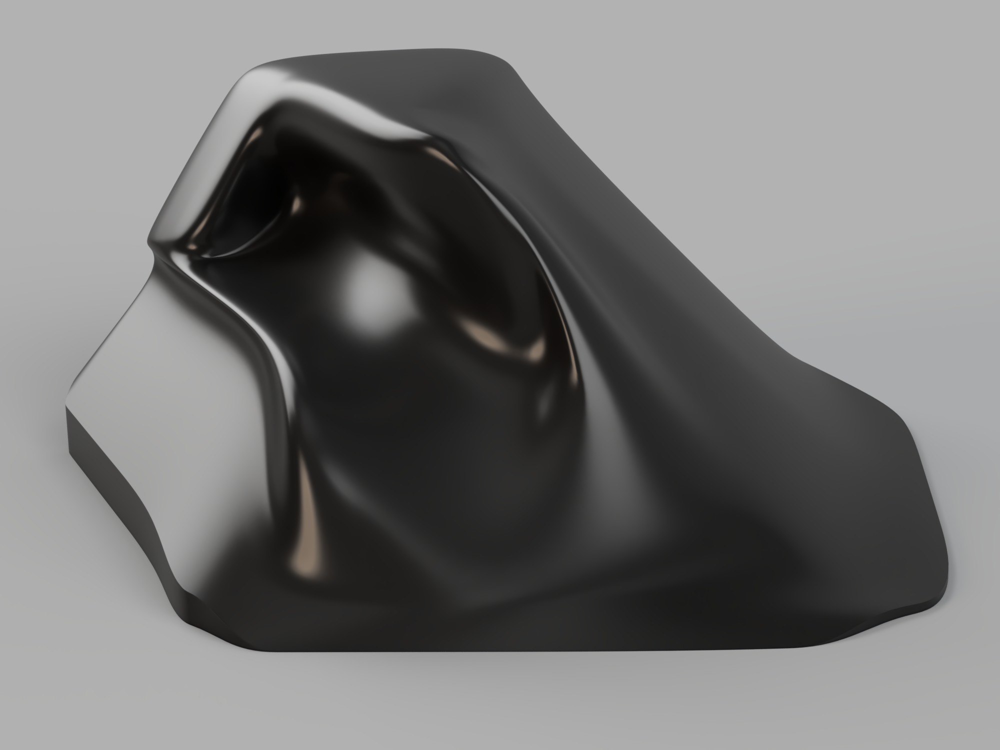

# ErgoWarrior

**ErgoWarrior is a completely open-source, ergonomic hitbox-style leverless controller. It was born out of a complete lack of open source ergonomic hitbox designs.**

*To the best of my knowledge, this is the **first open source** Ergonomic Hitbox on a public platform.*

**WIP Right Half of ErgoWarrior**

## Why an Ergo-Design Matters

Traditional flat controllers force the wrists and fingers into unnatural positions. Over time, this can lead to discomfort, fatigue, and even injuries such as repetitive strain injury (RSI) or carpal tunnel syndrome.

An ergo-design, **like ErgoWarrior**, is built to keep your hands and wrists in a natural, relaxed posture. This brings several benefits:

- **Reduced Strain and Injury Risk**: Many people (myself included) are highly prone to wrist injuries, ErgoWarrior is designed to keep wrists neutral, lowering stress on muscles and tendons.
- **Better Comfort for Extended Use**: Less fatigue during long sessions.
- **Improved Precision and Performance**: Inputs are always in reach and yet equally intuitive.
- **Natural Hand Posture**: Designed to closely match human anatomy for optimal control and comfort.
- **Advanced Techniques Still Possible**: Techniques like double taps or quick buffering inputs are still very much preserved and possible.

In short, ergonomic designs are not just about comfort, they improve performance and intend to protect your hands over the long term.

### Firmware

Firmware used for ErgoWarrior is a tweaked build of [GP2040-CE](https://github.com/OpenStickCommunity/GP2040-CE).

## Timeline

### v0 (Alpha and Beta Builds)

A kof style 4+4 (L+R) controller will be released as Alpha by mid-October with a beta build arriving on the same platform in late October.

### v1 (Full Release)

A Third-Strike style controller with a (6+10)* (L+R) layout is currently slated for release in mid-November.

\* **Tentative, may change.**