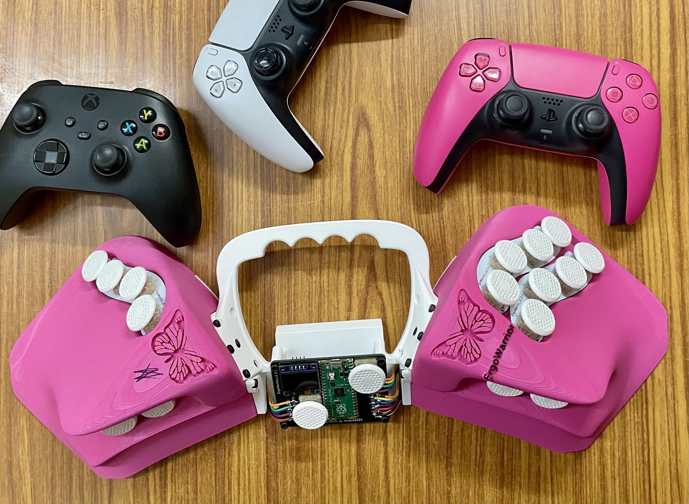
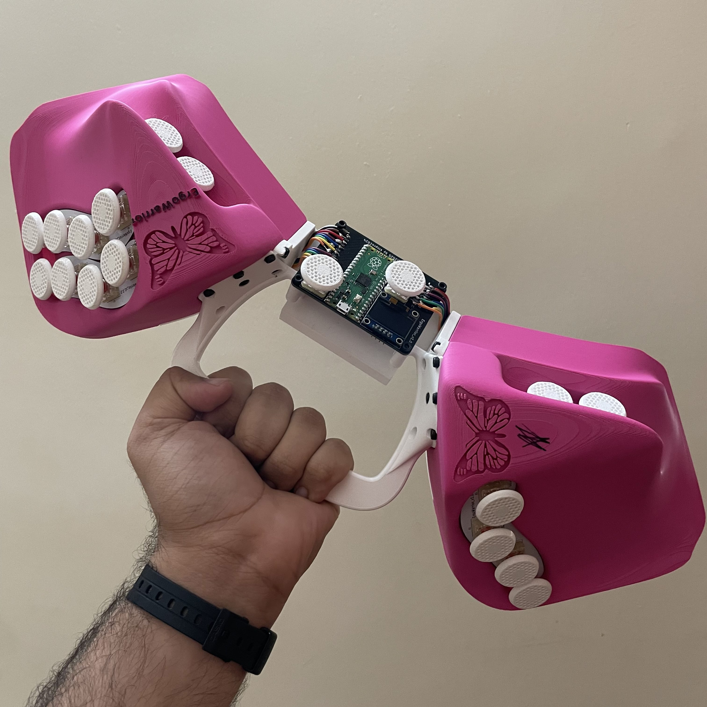
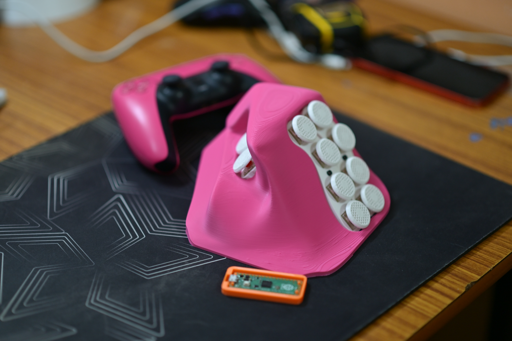
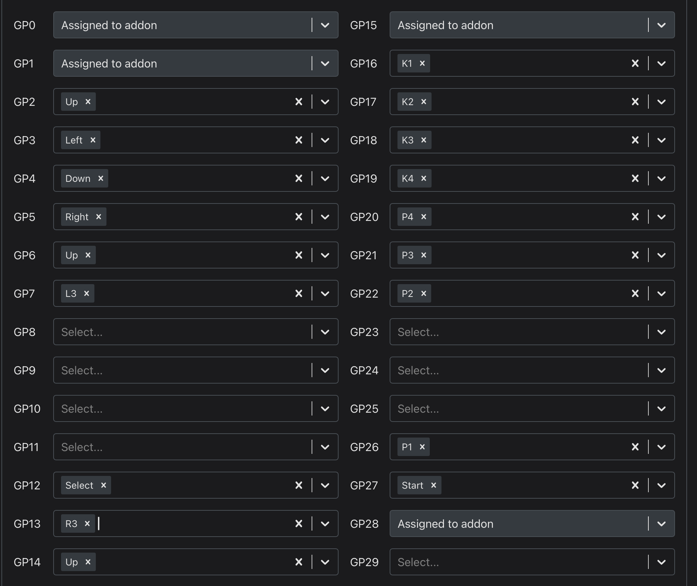

# ErgoWarrior

**ErgoWarrior is a completely open-source, ergonomic hitbox-style leverless controller. It was born out of a complete lack of contoured open-source ergonomic hitbox designs.**

*To the best of my knowledge, this is the **first open-source** Contoured Ergonomic Hitbox on a public platform.*

**ErgoWarrior v1.0.0 Mechanical Design.**

**ErgoWarrior v1.0.0 has a robust handle.**

**Right Half of ErgoWarrior's Pre-Alpha Build.**

## Why an Ergo-Design Matters

Traditional flat controllers force the wrists and fingers into unnatural positions. Over time, this can lead to discomfort, fatigue, and even injuries such as Repetitive Strain Injury (RSI) or Carpal Tunnel Syndrome.

An ergo-design, **like ErgoWarrior**, is built to keep your hands and wrists in a natural, relaxed posture. This brings several benefits:

- **Reduced Strain and Injury Risk**: Many people (myself included) are highly prone to wrist injuries, ErgoWarrior is designed to keep wrists neutral, lowering stress on muscles and tendons.
- **Better Comfort for Extended Use**: Less fatigue during long sessions.
- **Improved Precision and Performance**: Inputs are always in reach and yet equally intuitive.
- **Natural Hand Posture**: Designed to closely match human anatomy for optimal control and comfort.
- **Advanced Techniques Still Possible**: Techniques like double taps or quick buffering inputs are still very much preserved and possible.

In short, ergonomic designs are not just about comfort, they improve performance and intend to protect your hands over the long term.

### Hardware and Assembly

Raspberry Pi Pico is the main dev-board platform for ErgoWarrior. May change to a custom dev-board in the future.

Cherry MX Low Profile switches are the switches used throughtout all forseen generations of Ergowarrior.

ErgoWarrior is designed to go with [M3 Hex Socket 10mm Screws](https://onlyscrews.in/products/m3-x-10mm-hex-allen-socket-head-high-tensile12-9-black-anodized-screw?_pos=17&_sid=9edb84e19&_ss=r) and [8mm M3 Injection Molding Brass Inserts](https://onlyscrews.in/products/m3-x-8mm-brass-threaded-inserts).

### Firmware

Firmware used for ErgoWarrior is a tweaked build of [GP2040-CE](https://github.com/OpenStickCommunity/GP2040-CE). Plug-and-Play firmware will drop soon. Until then stock GP2040-CE for the Raspberry Pi Pico must be used. Keybinds as below:

## Timeline

### v0 (Alpha and Beta Builds) (Released on 19/Oct/2025) (Deprecated)

A kof style 4+4 (L+R) controller will be released as Alpha by mid-October with a beta build arriving on the same platform in late October. (Alpha Build out.) (Beta build cancelled, changes merged with v1.)

### v1 (Full Release) (Released) (Released on 29/Nov/2025)

A Third-Strike style controller with a (6+10)* (L+R) layout is currently slated for release in ~~mid-November~~ late-November (Delay in arrival of PCBs).
**Print Settings:** All Prints except the ultralight arcade button are done at 0.2mm layer height with the latter at 0.08mm LH. Refer to 3mf files for full details.
**Note:** Some Sanding is required on the jump buttons for optimal fit.

\* **Tentative, may change.**